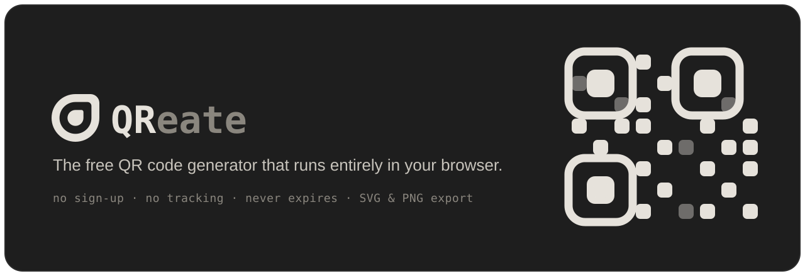

<div align="center">
  

  <p align="center">
    <a href="#features">Features</a> •
    <a href="#getting-started">Getting Started</a> •
    <a href="#how-it-works">How It Works</a> •
    <a href="#tech-stack">Tech Stack</a> •
    <a href="#contributing">Contributing</a>
  </p>

  <p align="center">
    
    
    
    
    
    
  </p>
</div>

---

QReate is a free, open-source QR code generator with a live preview. You can tweak the colors, module shapes, corner styles, and drop your own logo in the middle, and watch the code update as you go. Everything runs in your browser, so whatever you put into a code (a Wi-Fi password, someone's contact details, a link) never leaves your device. The codes are static, which means they don't expire, there's no scan limit, and nothing breaks if some third-party redirect service disappears.

## Features

- Free with no limits. No account, no watermark, nothing hidden behind a paywall.
- Runs on your device. Codes are built in the browser, so nothing you type gets uploaded anywhere.
- Codes never expire. The content is baked straight into the code, so there's no redirect to break and no cap on scans.
- 11 content types: URL, plain text, Wi-Fi, vCard, email, SMS, phone, geolocation, calendar event, cryptocurrency, and raw bytes.
- Styling that goes deep: 12 module shapes, custom corner (finder) patterns, any color, and transparent backgrounds.
- Add your logo. Upload an image, size it, set its opacity, and clear the modules behind it so it stays readable.
- Export for print or screen. Save as SVG, or PNG/JPEG up to 4096px, or just copy it to the clipboard.
- Share with a link. The whole design is packed into the URL, so sending the link hands someone the exact same code.
- Light and dark themes, responsive layout, and keyboard support.

## Supported QR types

Every type also has its own page (which helps with search) that opens the tool already set to that type.

| Type               | Route               | What it does                               |
| ------------------ | ------------------- | ------------------------------------------ |
| URL                | `/url-qr-code`      | Link to any website                        |
| Wi-Fi              | `/wifi-qr-code`     | Join a network without typing the password |
| vCard              | `/vcard-qr-code`    | Add a contact / digital business card      |
| Text               | `/text-qr-code`     | Show any message, even offline             |
| Email              | `/email-qr-code`    | Open a prefilled email                     |
| SMS                | `/sms-qr-code`      | Open a prefilled text message              |
| Phone              | `/phone-qr-code`    | Tap to call                                |
| Location           | `/location-qr-code` | Open GPS coordinates in maps               |
| Event              | `/event-qr-code`    | Add an event to the calendar               |
| Crypto, raw bytes  | `/`                 | Wallet addresses and arbitrary payloads    |

## Getting Started

### Prerequisites

- Node.js 20 or newer
- [pnpm](https://pnpm.io/) (the repo is set up around it)

### Installation

```bash
# clone the repository
git clone https://github.com/<your-username>/qreate.git
cd qreate

# install dependencies
pnpm install

# start the dev server
pnpm dev
```

Open [http://localhost:3000](http://localhost:3000) and start making codes.

### Scripts

| Command                                                 | Description                       |
| ------------------------------------------------------- | --------------------------------- |
| `pnpm dev`                                              | Start the development server      |
| `pnpm build`                                            | Create a production build         |
| `pnpm start`                                            | Serve the production build        |
| `pnpm lint`                                             | Run ESLint                        |
| `pnpm release <patch\|minor\|major\|X.Y.Z> "<message>"` | Bump the version, commit, and tag |

## How It Works

A few parts are worth knowing about if you're poking around the code.

**Everything runs on the client.** The QR is drawn in the browser with [`@lglab/react-qr-code`](https://github.com/lostgenius-lab/react-qr-code). No server ever sees your data, and because the content lives inside the code itself, the code keeps working forever.

**The design lives in the URL.** When you change something, the config gets compared against the page defaults and packed into a `?c=` parameter. Small designs use plain Base64, and larger ones switch to `deflate-raw` compression automatically. Refreshing keeps your work, and sharing is just copying the URL.

**It figures out the size before drawing.** [`lib/qr-size.ts`](lib/qr-size.ts) redoes the encoder's version math, so the app can show you the code's dimensions and handle a "too much data" case cleanly instead of crashing mid-render.

**Built with search in mind.** The homepage and every type page are static, each one carrying its own metadata, JSON-LD, Open Graph image ([`lib/og.tsx`](lib/og.tsx)), plus a generated `sitemap.xml` and `robots.txt`.

## Tech Stack

- [Next.js 16](https://nextjs.org/) (App Router, React Compiler, Turbopack)
- [React 19](https://react.dev/) and [TypeScript](https://www.typescriptlang.org/)
- [Tailwind CSS 4](https://tailwindcss.com/) with [Base UI](https://base-ui.com/) primitives
- [Zustand](https://github.com/pmndrs/zustand) for state
- [@lglab/react-qr-code](https://github.com/lostgenius-lab/react-qr-code) for rendering
- [Phosphor Icons](https://phosphoricons.com/) and [react-colorful](https://github.com/omgovich/react-colorful)

## Project Structure

```text
app/                 # routes, metadata, sitemap/robots, OG images
  [slug]/            # per-type landing pages (wifi-qr-code, etc.)
components/
  actions/           # copy, download, share, reset
  landing/           # server-rendered marketing sections + JSON-LD
  layout/            # generator shell, nav, footer
  settings/          # the customization panel (content, style, image)
hooks/               # QR value + size derivation
lib/                 # qr-size, share-state codec, page content, OG
stores/code-config/  # Zustand store + provider
```

## Deployment

QReate is a standard Next.js app, so it runs anywhere that runs Node (Vercel, for example).

Set one environment variable so the canonical URLs, sitemap, and Open Graph tags point at your domain:

```bash
NEXT_PUBLIC_SITE_URL=https://your-domain.com
```

## Contributing

Contributions are welcome. Open an issue if you want to talk something through first, or send a pull request:

1. Fork the repo and make a branch: `git checkout -b feature/my-change`
2. Make your changes, and keep `pnpm lint` and `pnpm build` passing.
3. Open a pull request that explains what you changed and why.

## License

Released under the [MIT License](LICENSE).

---

<div align="center">
  Built by <a href="https://x.com/gabrielerizzoo">Gabriele Rizzo</a>. If QReate is useful to you, consider <a href="https://buymeacoffee.com/gabrielerizzo">buying a coffee</a> ☕
</div>
